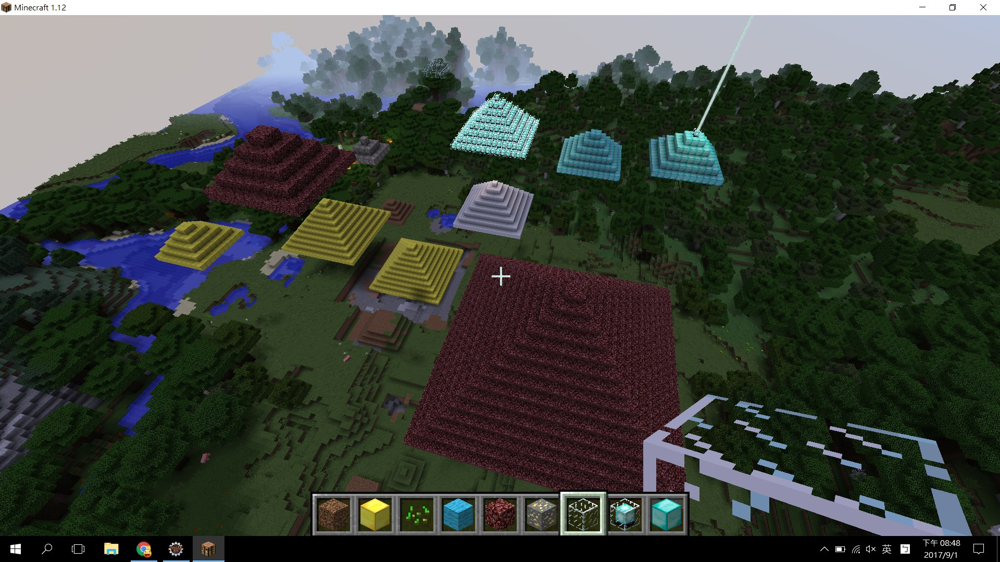
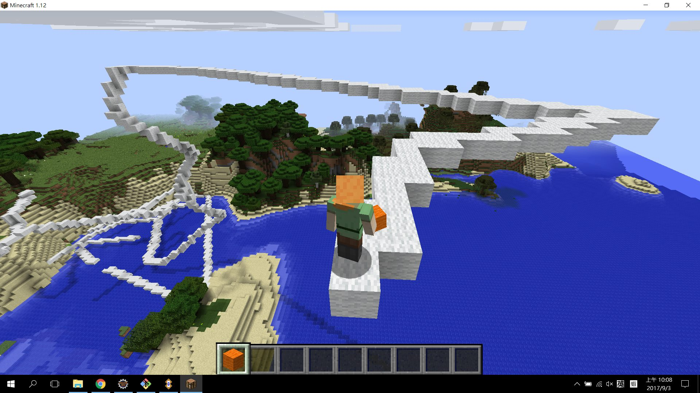

# craftsman

I'm playing Minecraft recently. Here is a mod which helps when playing. It's based on forge-1.12-14.21.1.2387-mdk. 

Currently, there are following commands: 

- Basic 
    - `build`
    - `destroy`
    - `empty`

- Building
    - `pyramid`

- Drawing
    - `cube`
    - `frame`
    - `turtle`

The following picture shows pyramids generated by the `pyramid` command.

You may be a turtle to `draw' your building.

I'll provide more docs if the mod is more stable.