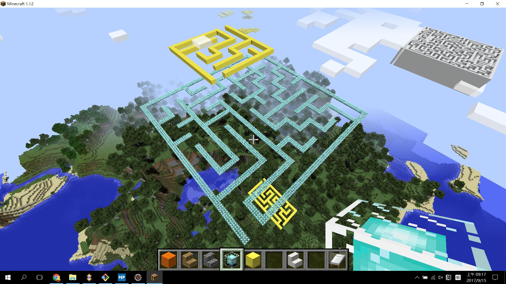

# craftsman

I'm playing Minecraft recently. Here is a mod which helps when playing. It's based on forge-1.12-14.21.1.2387-mdk. 

Currently, there are following commands: 

- Building
    - `pyramid`
    - `stairs`
    - `maze`

- Drawing
    - `cube`
    - `frame`
    - `turtle`
    - `line`
    - `circle`
    - `fillCircle`
    - `sphere`
    - `face`

Just type the command, such as `/pyramid`. It will show the information about how to provide parameters from the first user's perspective. For example:

    /cube <ux> <uy> <uz> <rows> <columns> <layers>

From the first user's perspective, the position `(ux, uy, uz)` of the block in front of the player is `(0, 0, 0)`. The front of the player is the positive direction of `ux`. the upside is `uy` and the right-hand side is `uz`.

The following picture shows pyramids generated by the `pyramid` command.

You may be a turtle to `draw' your building.

Do you want to challenge mazes?

